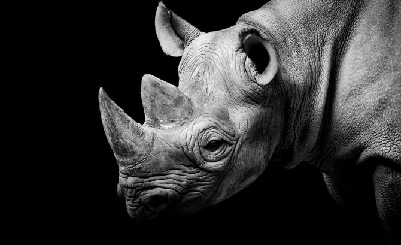

# Blackrhino

###### The black rhinoceros or hook-lipped rhinoceros (Diceros bicornis) is a species of rhinoceros, native to eastern and southern Africa including Botswana, Kenya, Malawi, Mozambique, Namibia, South Africa, Swaziland, Tanzania, Zambia, and Zimbabwe. Although the rhinoceros is referred to as black, its colors vary from brown to grey. (source: https://en.wikipedia.org/wiki/Black_rhinoceros)

## Personal source code repository.

